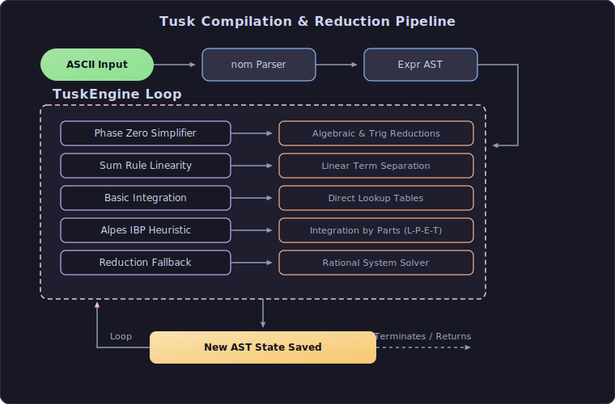

# Tusk

A high-performance Rust Terminal UI calculus engine for step-by-step symbolic integration using algebraic heuristics and rational reduction fallbacks.

**Tech Stack:**

---

##  Features

* **Transformation Pipeline:** Computes AST sequence for step history traversal.
* **Phase Zero:** Automatic algebraic, fraction, and trigonometric pre-simplification.
* **ALPES Heuristics:** Hierarchical scoring (L-P-E-T) for optimal integration (e.g. IBP).
* **Reduction Fallback:** Exact rational integration solver when heuristics do not match.
* **Interactive UI:** Time-travel debugging via `ratatui` terminal interface.

##  Pipeline

## Syntax (.tk)

* **Operators:** `+`, `-`, `*`, `/`, `^` *(explicit multiplication required, e.g. `3 * x` instead of `3x`)*
* **Functions:** `sin(x)`, `cos(x)`, `exp(x)`, `ln(x)`
* **Integration:** `int(integrand, var)` *(e.g. `int(x^2, x)` or implicit `int(x^2)` over `x`)*

## Installation

Download pre-built binary executables directly from the [Releases](https://github.com/AKRiLLiCK/tusk/releases) page.

### Keybindings

* **Tab:** Complete keywords (`int(`, `sin(`, etc.)
* **Up / Down:** Step backward/forward in history
* **Esc:** Exit

## License

[MIT License](LICENSE)

